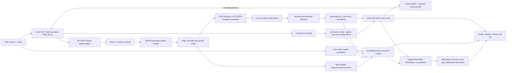

# Baddy final tracking and quantification optimization plan

**Date:** 2026-07-14  
**Status:** Accepted; delivery staged — Slice 0 + Slice A land as TASK-044,
Slices B–E queued in the PRIMARY_PRD remediation queue  
**Scope:** Player identity, pose keypoints, shuttle tracking, worker sampling,
YOLO26 versus RF-DETR evaluation, RF-DETR player segmentation, event detection,
and trustworthy match quantification

## 1. Outcome and decisions

This document consolidates the tracking changes discussed after reviewing the
current Baddy code path.

The main conclusion is that model quality and temporal tracking quality are
separate problems. A stronger pose model may improve individual-frame
keypoints, but it will not by itself prevent a track from switching people or
reject a high-confidence keypoint teleport.

Decisions:

1. Keep `yolo26l-pose.pt` as the production pose baseline until a Baddy-labelled
   comparison proves a replacement is better.
2. Add temporal identity and keypoint rejection before adding more visual
   smoothing. One-Euro remains the final jitter smoother, not the outlier
   detector.
3. Evaluate `RFDETRKeypointPreview` in shadow mode against YOLO26 rather than
   replacing the production model immediately.
4. Add RF-DETR instance segmentation as a separate `player_segmentation` task.
   In the first version, existing YOLO/BoT-SORT IDs remain authoritative and RF
   masks are attached by overlap matching.
5. Use player masks to improve occlusion reasoning, ReID crops, court-contact
   points, camera containment, and high-resolution per-player pose crops.
6. Preserve the current shuttle filtering, then close its short-orphan and
   canonical-clean-track gaps.
7. Replace the 180-frame-per-rally cap so long rallies retain a true temporal
   cadence instead of being spread across increasingly large time gaps.
8. Gate every model change on labelled Baddy footage, especially far-court
   doubles players. Generic COCO benchmarks are useful for choosing candidates,
   not for making the release decision.
9. Fuse audio, shuttle, wrist, and racquet evidence into availability-aware hit
   events; do not make accepted 3D shots the only source of hit timestamps.
10. Use offline forward-backward estimation for analytics, but segment at hits,
    identity transitions, and motion discontinuities so smoothing never erases
    a real shuttle reversal or player change of direction.
11. Publish movement, shot, and speed statistics only with calibration health,
    provenance, and uncertainty attached.
12. Spend additional compute adaptively: high frame rate and high resolution
    around likely contacts, ambiguous associations, far players, and unhealthy
    track segments instead of on every frame equally.

## 2. Current pipeline and confirmed behavior

### 2.1 Player and pose path

The RunPod worker currently:

- samples rally frames at a target `BADDY_SAMPLE_FPS=6`;
- caps analysis at `BADDY_MAX_FRAMES_PER_RALLY=180`;
- runs `yolo26l-pose.pt` by default;
- runs persistent BoT-SORT with ReID, tuned for the sparse 6 Hz stream;
- keeps each player box paired with its keypoints and `track_id`;
- applies a court-polygon gate before keeping up to four players.

Canonicalization normalizes coordinates to frame-relative `[0,1]`, preserves
the worker `track_id`, and applies a player-feet court gate. Public pose output
then assigns bounded player IDs and applies a per-person, per-joint One-Euro
filter.

Existing protections:

- court filtering removes many adjacent-court or spectator detections;
- BoT-SORT/ReID reduces identity churn;
- worker IDs are used when their coverage is sufficient;
- a motion-and-size heuristic is available when worker IDs are insufficient;
- One-Euro reduces low-amplitude keypoint jitter;
- Studio hides keypoints below confidence `0.15` and briefly holds missing IDs.

Confirmed gaps:

- no whole-person physical jump rejection after identity assignment;
- no per-joint velocity, acceleration, or innovation rejection;
- no bone-length or skeleton-topology consistency check;
- no check that a pose remains spatially consistent with its player mask/box;
- low-confidence keypoints bypass the smoother but remain in the data;
- the fallback ID path can reuse a similarly sized historical slot without a
  final absolute spatial-distance gate;
- Studio can interpolate the same ID across a pose gap of up to `0.9s`, turning
  an identity error into a smooth but false glide;
- wrist and ankle analytics confidence-gate measurements but do not reject a
  high-confidence temporal spike.

A focused reproduction confirmed the failure mode: a same-ID, high-confidence
joint moving `x=0.10 -> 0.90 -> 0.12` was smoothed to
`0.10 -> 0.7645 -> 0.31707`. The false measurement was softened but not
rejected and continued to influence the next frame.

### 2.2 Shuttle path

The shuttle already has a substantially stronger post-detection chain:

- forward and backward constant-velocity innovation scoring;
- a hard maximum-speed rejection;
- static-run removal for lights, posts, or a stationary shuttle;
- confidence and bounds filtering;
- a multi-pass Hampel-style local trajectory filter;
- a lateral court-segment gate;
- short-gap interpolation only;
- the same filtered track in the public overlay, virtual camera, baked render,
  and 3D reconstruction.

A synthetic shuttle teleport was removed completely in the audit. The remaining
gaps are narrower:

- one- and two-point orphan segments have insufficient local context and can
  survive;
- canonical storage retains refined low-confidence observations for audit, while
  consumers independently invoke the final spatial filter;
- a new consumer could accidentally read the refined-but-not-cleaned list;
- TrackNet's own heatmap confidence and explicit `predicted`/`inpainted`
  provenance are not yet carried through.

### 2.3 The 180 value

There is no 180-second pipeline timeout in the reviewed code. The relevant
limit is 180 sampled frames **per rally**:

```python
n = min(MAX_FRAMES_PER_RALLY, ceil(rally_duration * SAMPLE_FPS))
```

At the six-frame-per-second target this means:

| Rally duration | Effective sampling rate |
|---:|---:|
| up to 30s | approximately 6 Hz |
| 60s | approximately 3 Hz |
| 180s | approximately 1 Hz |

The cap bounds GPU work and payload size, but long rallies give the tracker much
larger motion gaps even though BoT-SORT is tuned for 6 Hz. This increases the
chance of missed far players, identity switches, keypoint discontinuities, and
misleading frontend interpolation.

The separate RunPod defaults are a 150-second no-worker stall check, a
900-second maximum queue wait, and a 1,200-second execution budget.

## 3. Target architecture



The central architectural change is one shared persistent player identity. A
box, mask, pose, foot point, wrist series, and eventual roster assignment must
all refer to the same player record rather than being independently relabelled
by different consumers. The second change is a closed quality loop: unhealthy
intervals receive targeted extra resolution/cadence, while healthy intervals
remain on the economical baseline path.

## 4. Proposed player and pose changes

### 4.1 Identity validation

Before accepting that a detection still belongs to an existing `track_id`,
compare it with the predicted player state using:

- box centre displacement normalized by player height;
- elapsed time;
- box IoU and size/aspect change;
- mask IoU when segmentation is available;
- ReID appearance similarity computed from masked player pixels;
- pose-shape distance as supporting evidence, not the sole identity signal.

If the spatial change is physically implausible and appearance/mask evidence
also disagrees, reject the association and create/reacquire a different track.
A similarly sized detection must not inherit an old ID without a distance gate.

### 4.2 Per-joint temporal sanitizer

Maintain a constant-velocity state for every `(track_id, keypoint)`:

```text
state = [x, y, vx, vy]
```

For every observation:

1. Predict the joint position using the real frame time delta.
2. Convert model confidence into observation uncertainty. If RF-DETR Keypoint
   supplies covariance, use it directly.
3. Compute the innovation between observation and prediction, normalized by
   body scale and uncertainty.
4. Reject measurements outside the tuned innovation gate.
5. Do not update state with a rejected measurement.
6. Allow larger motion/process noise for wrists and ankles than for hips,
   shoulders, and torso joints.

The gate must be body-relative rather than one global frame-distance threshold:
a far player and a near player occupy very different pixel scales.

Implementation note (TASK-044): at the 6 Hz production cadence a wrist
legitimately reverses direction between adjacent samples, so a constant-velocity
prediction overshoots at exactly the moments that matter (hits). The shipped v1
sanitizer therefore gates on body-relative *displacement per elapsed time*
(zero-velocity prediction), which is monotonic and reversal-safe; full
forward-backward constant-velocity estimation arrives with the Slice D analytics
smoother, where it can be segmented at hits.

### 4.3 Skeleton consistency

Use the rolling median body geometry from stable observations:

- shoulder width, hip width, and torso length;
- upper/lower arm and leg lengths;
- joint containment inside an expanded player mask or box;
- agreement between visible joints and the current box/mask translation.

Reject an individual joint when it creates an implausible limb change. Do not
reject a real jump merely because the body moves: a genuine jump moves the box,
mask, and most joints coherently, whereas a wrong pose attachment or isolated
joint error does not.

Implementation note (TASK-044): 2D projection can only *shorten* a bone
(foreshortening) — it can never lengthen one past the player's true reach. The
shipped check therefore keys on a bone suddenly exceeding its rolling maximum
observed length (the signature of a wrist or ankle attached to a different
person) and never rejects foreshortening or re-extension.

### 4.4 Missing data, provenance, and smoothing

Rejected observations become missing measurements rather than low-confidence
coordinates that remain in the track. Every emitted point should carry:

```text
provenance = observed | rejected | interpolated | predicted
```

Rules:

- only accepted observations update the temporal state;
- interpolate no more than approximately `0.25-0.35s` initially;
- decay confidence on interpolated/predicted values;
- preserve longer gaps honestly;
- apply One-Euro only after rejection and short-gap handling;
- Studio and analytics must consume the same canonical clean pose track;
- frontend interpolation must never bridge a rejected identity transition.

The lowest-risk first implementation can sanitize the public pose track after
IDs are assigned and before One-Euro. The durable implementation belongs in the
shared canonical player/pose identity layer so every consumer receives the same
result.

## 5. RF-DETR player segmentation

### 5.1 Why add it

Player instance masks provide evidence that boxes and raw pose keypoints cannot:

- distinguish overlapping doubles players more precisely than box IoU;
- compute ReID embeddings without court/background contamination;
- measure partial occlusion and visible-body ratio;
- reject pose joints falling outside the player's visible region;
- estimate a better court-contact point from the bottom of the mask;
- generate accurate player crops for far-player pose inference;
- improve virtual-camera containment and player cutout effects;
- support background blur, player trails, and tactical overlays.

Segmentation improves association evidence but does not replace the temporal
pose filter.

### 5.2 Initial model and operating mode

Start with `RFDETRSegMedium` in shadow mode. Official COCO/T4 figures at the
time of this review report:

| Model | Mask AP50:95 | T4 TensorRT latency | Parameters | Default resolution |
|---|---:|---:|---:|---:|
| RF-DETR-Seg-M | 45.3 | 5.9ms | 35.7M | 432x432 |
| RF-DETR-Seg-L | 47.1 | 8.8ms | 36.2M | 504x504 |

Medium is the first accuracy/cost candidate, not an automatic production
choice. The default resolution may be insufficient for far-court badminton
players. Run the model on the court ROI and benchmark higher supported input
resolutions before selecting the deployed shape.

RF-DETR segmentation and RF-DETR Keypoint are separate released variants. Using
both off the shelf requires two inference passes. A shared mask-plus-keypoint
backbone would be a later custom optimization.

### 5.3 First integration

Add a `player_segmentation` task to the RunPod request. The worker should:

1. load and cache a pinned RF-DETR segmentation model once per process;
2. bake/cache the checkpoint in the worker image to avoid cold downloads;
3. run person segmentation on the court ROI for the sampled frames;
4. map masks and boxes back into source-normalized coordinates;
5. court-gate and confidence-filter results;
6. match masks to the existing YOLO/BoT-SORT player boxes using Hungarian IoU;
7. attach the authoritative existing `track_id` to matched masks;
8. report unmatched masks for evaluation without steering production behavior.

This preserves the current proven tracker while measuring whether masks improve
far-player recall and association. If the benchmark later shows RF-DETR boxes
are clearly better, RF-DETR can become the detector of record with a dedicated
external tracker.

### 5.4 Proposed mask contract

Do not put full bitmap arrays into `result.json`. Use compressed COCO RLE or a
compact polygon at sampled frames:

```json
{
  "t": 12.4,
  "player_masks": [
    {
      "track_id": 2,
      "confidence": 0.91,
      "bbox": {"x1": 0.42, "y1": 0.26, "x2": 0.55, "y2": 0.73},
      "mask_rle": "compressed-rle",
      "visible_ratio": 0.84,
      "occlusion_ratio": 0.16,
      "source": "rf-detr-seg-m"
    }
  ]
}
```

For pixel-accurate render effects, generate a separate low-bandwidth player-ID
mask video or render the effect worker-side instead of expanding masks in the
public JSON response.

## 6. Shuttle hardening changes

Retain the existing filter chain. Add:

1. An orphan policy: a one- or two-point flight segment is not accepted as a
   real trajectory without corroborating TrackNet heatmap, audio impact,
   wrist/racquet event, or adjacent coherent segment evidence.
2. One canonical clean shuttle track used by every downstream consumer.
3. A separate rejected-observation audit list if debugging visibility is needed.
4. TrackNet heatmap confidence when available.
5. Explicit `observed`, `inpainted`, `interpolated`, and `predicted` provenance.
6. No predicted shuttle point should drive 3D speed or hit inference until it
   passes a labelled benchmark gate.

## 7. Sampling and payload changes

Replace the fixed 180-frame rally cap with a policy that preserves cadence:

- keep approximately 6 Hz for player/pose/tracker updates;
- process long rallies in bounded batches rather than lowering temporal rate;
- carry tracker state across batches;
- stream or compact results rather than reducing the source cadence;
- maintain a separate public/API sampler after tracking, with real gaps
  preserved;
- record `requested_sample_fps`, `effective_sample_fps`, `sample_count`, and
  cap/degradation reason in each rally's metadata.

If cost requires an adaptive rate, it must be explicit and tracker-aware. For
example, lower cadence only in confirmed dead time and retain full cadence
during the in-play mask, rather than uniformly spreading 180 samples across the
entire rally.

## 8. Model-selection plan

### 8.1 Production baseline

Keep YOLO26l-pose because it is already integrated with the worker, paired with
BoT-SORT, baked into the image, and understood operationally. Its presence is
not proof that it wins on Baddy; it is the control model.

### 8.2 RF-DETR Keypoint candidate

RF-DETR Keypoint Preview is a credible challenger because its official COCO
checkpoint reports strong accuracy and exposes per-keypoint uncertainty. The
uncertainty is particularly useful for principled innovation gating.

Risks:

- preview API and checkpoint may change;
- the checkpoint and latency profile differ substantially from the current
  YOLO26l worker;
- generic COCO accuracy does not prove far-court badminton performance;
- switching the model does not remove the need for a persistent tracker and
  temporal sanitizer.

### 8.3 Baddy A/B decision metrics

Run YOLO26l-pose, RF-DETR Keypoint Preview, and the crop-based variants on the
same labelled frames and report separately for near and far players:

- player detection recall and exact player count;
- overcount/background-player rate;
- ID switches per player per rally;
- PCK@0.05 by player distance and joint group;
- keypoint dropout and longest gap;
- false joint jumps per 1,000 observations;
- bone-length coefficient of variation;
- wrist-spike precision around labelled hits;
- end-to-end worker latency, peak VRAM, cold start, and payload size.

Existing release gates remain:

- player exact count at least 90% of frames;
- player overcount below 2%;
- no more than one ID switch per player per rally;
- pose PCK@0.05 at least 85% near court and 70% far court;
- shuttle F1 at least 0.87 within 10 px at 512x288 and no more than one
  teleport per 1,000 visible frames.

Model-specific latency numbers are candidate-selection inputs only. Production
selection requires end-to-end Baddy measurements at the actual court crop,
input resolution, sampling cadence, and RunPod runtime.

## 9. Quantification and offline-analysis optimizations

The existing `analysis.json` already exposes shuttle flight windows, audio
peaks, accepted 3D shots, wrist series, and player positions in court metres.
The next step is to fuse and qualify these signals rather than publishing each
one independently.

### 9.1 Availability-aware hit detection

Create hit candidates from four independent sources:

1. a fine audio impact peak;
2. a shuttle direction or acceleration discontinuity;
3. a wrist-speed/acceleration spike from a tracked player;
4. racquet evidence and shuttle-to-racquet closest approach when available.

Do not require a rigid two-of-three rule. Score the evidence that was actually
available in the interval so a TrackNet dropout or missing wrist does not
automatically delete a real hit. Require stronger agreement when several
signals disagree.

Timing must match the current extractors:

- audio RMS uses a `0.10s` window with a `0.05s` hop, so stored peak timestamps
  do not have true 10 ms precision even though they are rounded to hundredths;
- start with approximately `100-150ms` audio-to-shuttle tolerance;
- start with approximately `200-250ms` wrist-to-event tolerance at 6 Hz;
- refine likely contacts with the high-frame-rate burst pass in section 10.1;
- replace the current `0.6s` audio-peak deduplication with a labelled,
  adaptive refractory interval so fast drive exchanges do not collapse into
  one hit.

Proposed event contract:

```json
{
  "t": 12.43,
  "player_id": 2,
  "confidence": 0.88,
  "evidence": {
    "audio": 0.92,
    "shuttle_turn": 0.84,
    "wrist": 0.76,
    "racquet": 0.61
  },
  "timing_uncertainty_ms": 85,
  "provenance": "fused_observed"
}
```

This hit stream becomes the shared primitive for shot count, rally tempo,
server/receiver inference, hitter attribution, recovery timing, shot
segmentation, and highlight ranking. Accepted 3D fits can enrich a hit with
speed and trajectory but must not be the only way a hit exists.

### 9.2 Segmented forward-backward state estimation

Baddy is an offline pipeline, so analytics can use the full rally. Run a robust
forward filter followed by a backward smoother before differentiating positions
into speed or acceleration.

Do not use one constant-velocity smoother over a complete rally:

- split shuttle tracks at fused hits, bounces, large gaps, and strong turns;
- use ballistic/drag-aware or interacting motion models between shuttle hits;
- split player tracks at identity transitions and long gaps;
- use constant-velocity/acceleration states for player roots;
- use body-relative, joint-dependent process noise for pose;
- preserve raw observations and emit the smoothed estimate plus uncertainty.

This prevents measurement noise from inflating distance and maximum speed while
also preventing the smoother from rounding off the contact reversal that
defines a badminton hit. Speeds should come from the estimated velocity state,
not a maximum over raw first differences.

### 9.3 Player movement and recovery analytics

After shared box/pose identity and reliable court calibration are available,
aggregate per-player measurements across rallies:

- distance covered per rally and match;
- median, high-percentile, and peak movement speed;
- court-zone occupancy and coverage heatmaps;
- direction-change and lunge counts;
- base-position estimate by rally phase;
- time from a hit to recovery near the player's base position;
- movement load per shot and per minute of in-play time;
- left/right and front/rear movement balance.

Player root speed also feeds tracking validation. A physically implausible
court-space displacement is identity-switch evidence, not athletic performance.
The initial maximum-speed and acceleration gates must be tuned on labelled
footage rather than fixed from generic assumptions.

Match-level aggregation requires cross-rally roster identity. Use explicit
roster pinning where available; otherwise combine team/court side, masked ReID,
appearance, and operator confirmation. Similar team kits make appearance alone
insufficient.

### 9.4 Shot type and placement

For each high-confidence shot segment, derive features already available from
the 3D path and court geometry:

- launch and net-plane speed;
- launch direction and vertical component;
- peak height;
- net clearance;
- flight duration;
- landing zone in front/mid/rear and left/centre/right court regions;
- hitter and receiver court positions at contact;
- preceding and following shot context.

Classify provisional `smash`, `clear`, `drop`, `drive`, `lift`, `net`, and
`serve` types with a mandatory `unknown` outcome. Classification is allowed
only when calibration and trajectory health pass their gates. Rules provide a
transparent first baseline; a learned classifier is justified only after a
labelled shot dataset exists.

The resulting shot sequence supports placement matrices, per-player shot
distributions, rally-pattern analysis, and a highlight score based on exchange
quality rather than Gemini intensity or duration alone.

### 9.5 Uncertainty and calibration health on published metrics

Every physical-unit or derived number should carry:

- value and unit;
- confidence class (`high`, `medium`, `low`, or `unavailable`);
- observation count and longest gap;
- source/provenance;
- court calibration health;
- an uncertainty interval where meaningful;
- a reason when the value is withheld.

Estimate uncertainty by perturbing both observations and calibration:

- sample shuttle/player/keypoint positions from their confidence/covariance;
- perturb court corners within measured/manual uncertainty;
- refit the trajectory or movement statistic across samples;
- publish robust percentiles rather than false decimal precision.

This is more representative than only dropping one point at a time because
court-corner uncertainty can dominate monocular metric error. A low-confidence
speed must be labelled or withheld, not displayed as an exact fact.

Add IDF1 and HOTA to the labelled tracking bench for comparability, while
retaining the current exact-count, overcount, switch, and PCK gates because they
remain easy to interpret and map directly to visible product failures.

## 10. Additional adaptive tracking optimizations

### 10.1 Event-triggered high-frame-rate bursts

Keep an economical baseline pass, then re-read the original/vision proxy at
`15-30fps` for short windows around:

- audio impact candidates;
- shuttle reversals or sudden acceleration;
- wrist/racquet candidates;
- low association margin or competing player assignments;
- occlusion entry/exit;
- track loss and reacquisition.

An initial window of roughly `0.5s` before and after a candidate provides enough
context for contact timing and short stroke phases. Merge overlapping windows
and impose a per-rally compute budget. This produces accurate hit/racquet/wrist
measurements without running whole-match pose at 30 fps.

Measure hit timestamp error, wrist/racquet PCK around contact, and added GPU
seconds per accepted hit.

### 10.2 Court-constrained identity association

Add court-space evidence to the tracker association cost:

- distance and acceleration in metres from the last accepted foot/mask root;
- whether a candidate remains on the correct side of the net;
- singles/doubles cardinality per court half;
- feasible court-region transitions over the real time delta;
- image-space box/mask IoU and size consistency;
- masked ReID appearance and pose-shape evidence.

Court constraints are powerful because a player cannot teleport through the
net even when image boxes overlap. They must fail open when homography health is
low. Bench IDF1, switches per player, and impossible net-crossing assignments.

### 10.3 Track-guided multi-resolution inference

Separate discovery from detailed estimation:

1. run full-court detection periodically and whenever tracks are lost;
2. predict each active player's next ROI;
3. run pose/segmentation on an enlarged high-resolution player crop;
4. allocate more input pixels to small/far players;
5. use court-half tiles for reacquisition when a far track disappears;
6. periodically refresh from the full frame to prevent crop drift.

This turns resolution into a per-player resource rather than resizing the whole
court uniformly. Compare far-player recall and PCK per GPU second against the
current whole-frame `imgsz=1920` path.

### 10.4 Track health and selective reprocessing

The current aggregate `player_quality` and `pose_quality` mostly combine model
confidence and coverage. Add a per-track health vector:

- observation coverage and longest gap;
- effective sampling cadence;
- association margin and number of competing matches;
- identity splits/merges and court violations;
- accepted/rejected innovation count;
- skeleton and bone-length residuals;
- mask temporal IoU and visible ratio;
- foot/root speed plausibility;
- raw versus interpolated/predicted fraction.

Use this vector to route only unhealthy intervals to a stronger pass: higher
resolution, denser sampling, RF-DETR segmentation/keypoints, or manual review.
Report recovery rate, false-rerun rate, and GPU minutes per match so quality
improves without unbounded compute.

### 10.5 Wrist-guided racquet contact microtracking

Upgrade the current whole-frame racquet detector and pose-guided Hough-line
fallback into a temporal contact tracker inside burst windows:

- crop around the accepted wrist/forearm and predicted racquet region;
- combine detector confidence, line/shaft orientation, optical flow, and
  temporal continuity;
- estimate racquet tip/head position rather than only a loose box;
- find shuttle-to-racquet closest approach near a fused hit candidate;
- attribute contact to the player whose wrist/racquet evidence agrees;
- keep an `unknown` contact when evidence is insufficient.

This unlocks contact timing, contact height, swing path/orientation, preparation
time, hitter attribution, and better forehand/backhand evidence. Bench racquet
recall, contact-time error, and hitter-attribution accuracy.

## 11. Test and benchmark additions

### Pose and identity regression fixtures

- same `track_id` abruptly switches between two people;
- same-ID whole skeleton teleports with high confidence;
- a single wrist, ankle, or shoulder teleports;
- a real jump is retained;
- a fast smash wrist is retained;
- player disappears behind an opponent and re-enters;
- doubles partners cross or overlap while wearing similar kits;
- far player is intermittently detected;
- rejected measurement does not contaminate later filter state;
- Studio does not interpolate across a rejected transition.

### Segmentation fixtures

- masks match the correct YOLO/BoT-SORT IDs;
- overlapping players retain separate masks;
- adjacent-court masks are removed;
- mask bottom produces a stable foot point;
- RLE encode/decode round-trips at source coordinates;
- masks do not inflate gallery/list payloads;
- segmentation failure is fail-open and does not remove existing pose output.

### Shuttle fixtures

- one- and two-point orphan segments are rejected or explicitly untrusted;
- fast coherent smashes survive;
- contact endpoints survive;
- predicted/inpainted points never silently claim `observed` provenance;
- every camera/render/Studio/3D consumer receives the same clean track.

### Event and quantification fixtures

- two rapid audio impacts inside the old `0.6s` deduplication window remain two
  candidates when shuttle/racquet evidence supports them;
- a hall noise transient without shuttle/wrist/racquet agreement is rejected;
- a real hit survives when one signal is missing;
- fused hit timestamp and hitter ID match labelled contact;
- the backward smoother never crosses a hit, identity transition, or long gap;
- smoothed constant motion reduces false distance without suppressing a real
  lunge/change of direction;
- movement speed and distance stay within court-physical bounds;
- low-calibration-health physical metrics are withheld;
- shot classifier emits `unknown` for ambiguous or unhealthy 3D fits;
- uncertainty intervals widen when point or corner noise increases;
- reported confidence/provenance survives the `analysis.json` round trip.

### Adaptive-compute fixtures

- event windows merge deterministically and respect the per-rally budget;
- burst samples retain source timestamps and map back to the canonical track;
- far-player crops improve resolution without swapping identities;
- crop drift triggers full-frame reacquisition;
- low homography health disables court-constrained association;
- impossible cross-net player assignment is rejected when calibration is sound;
- track-health scoring identifies known identity and pose failures;
- selective reprocessing changes only the unhealthy interval;
- racquet microtracking preserves fast real motion and rejects unrelated lines;
- fallback behavior remains equivalent when optional RF-DETR/burst models fail.

Every release candidate must also be reprocessed against a real uploaded Baddy
video. Unit tests prove contracts; they do not prove far-player visibility,
identity continuity, mask quality, or perceived Studio smoothness.

## 12. Staged delivery plan

### Slice 0 — measurement, cadence, and health foundations

- record requested/effective FPS, sample count, gaps, and degradation reason;
- add per-track health vectors alongside aggregate quality;
- add labelled fixtures for identity swaps, rapid hits, far players, and long
  rallies;
- replace or batch the 180-frame cap while measuring compute/payload impact;
- preserve true cadence before tuning temporal thresholds;
- add selective-reprocessing routing in shadow mode.

This slice makes later A/B results interpretable. Removing the cap is not free:
GPU inference and payload grow with processed frames, so cadence preservation
must ship with compaction, batching, and cost telemetry.

### Slice A — canonical identity, court constraints, and pose sanitizer

- add the shared box/pose identity map;
- close the similarly-sized-slot spatial-gate hole;
- add image- and court-space association gates;
- add per-joint innovation and skeleton checks;
- emit provenance, uncertainty, and honest gaps;
- reduce Studio interpolation across pose gaps;
- add pose/identity regression tests.

This is the highest-value visible correctness slice and aligns with queued
TASK-036/TASK-037.

### Slice B — adaptive high-resolution player and contact passes

- add event-triggered `15-30fps` burst windows;
- add track-guided high-resolution player crops and lost-track tiles;
- map crop detections/keypoints back to source coordinates;
- add wrist-guided temporal racquet/contact tracking;
- measure incremental GPU cost per recovered player/hit.

### Slice C — RF-DETR segmentation and keypoint shadow evaluation

- add the pinned RF-DETR dependency and baked checkpoints/engines;
- add the segmentation worker task, model metadata, and compact mask contract;
- match masks onto existing authoritative IDs;
- persist masks without changing production camera behavior;
- compare YOLO26 and RF-DETR Keypoint on identical player crops;
- route only ambiguous/unhealthy intervals to the more expensive candidate
  before considering full replacement.

### Slice D — fused events and qualified analytics

- implement availability-aware hit fusion and hitter attribution;
- segment and forward/backward-smooth shuttle/player/pose states;
- derive movement/recovery metrics in court metres;
- add provisional shot type and placement with `unknown` fallback;
- propagate observation and calibration uncertainty;
- add metric confidence/provenance to `analysis.json` and Studio.

### Slice E — shuttle contract and consumer rollout

- add shuttle orphan, TrackNet confidence, and provenance rules;
- expose one canonical clean shuttle and pose/player track;
- migrate Studio, analytics, camera, render, and 3D to those tracks;
- add optional player-mask visualization/effects only after temporal mask gates;
- reprocess fresh real footage;
- verify worker image/version, effective FPS, model metadata, clean/rejected
  tracks, fused hits, analytics, render, and Studio separately before enabling
  any new behavior by default.

## 13. Rollout and safety requirements

- Use a dedicated task branch off `main`; do not mix this work with the active
  Schools UI branch.
- Add a current task file and cite the relevant PRIMARY_PRD tracking sections.
- Pin the tested RF-DETR/package/runtime versions.
- Bake model weights or an exported engine into the worker image to avoid cold
  runtime downloads.
- Keep YOLO pose and no-segmentation fallbacks until the new path passes the
  labelled benchmark.
- Start segmentation and RF keypoints in shadow mode.
- Record exact model, resolution, device, engine, and effective sampling rate in
  the result metadata.
- Run `./scripts/check.sh`, targeted tracking tests, the Phase-0 bench, a RunPod
  smoke test, and a fresh real upload before rollout.
- Bounce warm RunPod workers after publishing a new image before trusting a
  verification job.
- Preserve raw observations for audit, but make clean canonical tracks the only
  default consumer input.

## 14. Non-goals for the first rollout

- A custom single RF-DETR backbone that emits masks and keypoints together.
- Full 3D human-pose lifting.
- Using predicted shuttle points as measured hit/speed evidence.
- Replacing TrackNetV3 without a labelled TrackNet A/B.
- Training a custom segmentation model before the pretrained shadow benchmark.
- Enabling player cutout effects before mask temporal stability is measured.
- Publishing exact speeds, distances, or shot classes when calibration or track
  health is insufficient.
- Running 30 fps pose/segmentation over every frame when bounded adaptive bursts
  provide the required event accuracy.

## 15. Code and research references

Current implementation:

- `runpod_worker/handler.py` — model loading, pose/tracker inference, frame cap
- `runpod_worker/botsort_baddy.yaml` — 6 Hz BoT-SORT/ReID tuning
- `app/pipeline/gpu.py` — worker-output canonicalization
- `app/pipeline/track.py` — player court gate and shuttle filters
- `app/pipeline/smooth.py` — One-Euro pose smoothing
- `app/pipeline/sanitize.py` — identity/kinematic pose sanitizer (TASK-044)
- `app/pipeline/audio.py` — fine audio RMS and impact candidates
- `app/pipeline/court.py` — image-to-court homography in metres
- `app/pipeline/evaluate.py` — main-court player pruning and ID-churn adoption
- `app/main.py` — public player/pose IDs and track sampling
- `web/app.js` — Studio interpolation and pose rendering
- `app/pipeline/analysis.py` — wrist and court-movement series
- `app/pipeline/render.py` — baked overlay consumer
- `app/pipeline/rally3d.py` — filtered shuttle 3D consumer
- `scripts/bench/metrics.py` — release metrics and gates
- `docs/benchmarks/PHASE0_BENCH.md` — labelled-bench protocol

Official model references checked for this design:

- RF-DETR Keypoint:
  <https://rfdetr.roboflow.com/develop/learn/run/keypoints/>
- RF-DETR Segmentation:
  <https://rfdetr.roboflow.com/latest/learn/run/segmentation/>
- RF-DETR export and TensorRT path:
  <https://rfdetr.roboflow.com/latest/learn/export/>
- RF-DETR repository and licensing:
  <https://github.com/roboflow/rf-detr>
- Ultralytics YOLO26:
  <https://docs.ultralytics.com/models/yolo26/>
- Ultralytics tracking:
  <https://docs.ultralytics.com/modes/track/>
